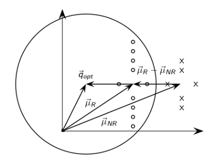

## Iterate files

Get Address (DFS): The DFS algorithm is a recursive algorithm that uses the idea of backtracking. It involves exhaustive searches of all the nodes by going ahead, if possible, else by backtracking.

Here, the word backtrack means that when you are moving forward and there are no more file/folder along the current path, you move backwards on the same path to find folder to traverse. All the nodes will be visited on the current path till all the unvisited nodes have been traversed after which the next path will be selected. 

## Make Index Construction: 

To better support different query task, we divide So I divide them into 26 parts by their initials

Separate a word into several bytes, every byte < 128, like 128 system. To identify a int, the 1st byte and the last byte should begin with 1 in binary form, just add 128 to them. Besides, in order to compress the file further, just record the increments between file number.
The most hard part of the problem is to decode the encoding file. 

## Decode Algorithm(FSM) :

* State 0: beginning or after reading a byte starting with 0
* State 1: while reading a int
* State 2: reading the int's last byte beginning with 1

The algorithm is implemented as the flow path:

## Bool Query

Here we provide bool query technique which Boolean search is a type of search allowing users to combine keywords with operators (or modifiers) such as AND, NOT and OR to further produce more relevant results.

The logic operation include "AND", "OR", "NOT". The logic operation in each file can be simulated just by set operation of each word. Here's a brief explanation. For "AND" : if word "a" and word "b" both appeared in file A, then the file will be selected, if either doesn't exist, the file will be deleted from query. "OR" and "NOT" are so.

**Weight for each word**: To be logically right, every word's weight can only be 1 and 0. The match is called exact match. 

## Vector Space Model

Each word in query is an element in the file-rank vector. Sum them up to get the file's score. The major steps are same in the Boolean Query.

**Tf-Idf Model**: Frequency: $f_{t,d}$ means that times the term(t) occurs in the doc(d).$N$ means the number of all files, $n$ means the number of files including the term. After testing, the best variant for TF is : $tf = 0.2 + 0.8 * f_{t,d}/max_{t'\in d}f_{t',d}$. Inverse Document Frequency: $log(1+N/n)$

**BM Model**: ${\text{score}}(D,Q)=\sum _{i=1}^{n}{\text{IDF}}(q_{i})\cdot {\frac {f(q_{i},D)\cdot (k_{1}+1)}{f(q_{i},D)+k_{1}\cdot \left(1-b+b\cdot {\frac {|D|}{\text{avgdl}}}\right)}}$

$\text{IDF}(q_i) = \log \frac{N - n(q_i) + 0.5}{n(q_i) + 0.5}$

## User Feedback
**Ricchio Algorithm**:
The algorithm is based on the assumption that most users have a general conception of which documents should be denoted as relevant or non-relevant. Therefore, the user's search query is revised to include an arbitrary percentage of relevant and non-relevant documents as a means of increasing the search engine's recall, and possibly the precision as well.

$$\overrightarrow{Q_m} = \bigl(a \cdot \overrightarrow{Q_o}\bigr) + \biggl(b \cdot {\tfrac{1}{|D_r|}} \cdot \sum_{\overrightarrow{D_j} \in D_r} \overrightarrow{D\_j}\biggr) - \biggl(c \cdot {\tfrac{1}{|D_{nr}|}} \cdot \sum_{\overrightarrow{D_k} \in D_{nr}} \overrightarrow{D_k}\biggr)$$

$\overrightarrow{Q_m}$ : Modified Query Vector	
$\overrightarrow{Q_o}$ : Original Query Vector
$\overrightarrow{D_j}$ : Related Document Vector
$\overrightarrow{D_k}$ : Non-Related Document Vector
$a$ : Original Query Weight						
$b$ : Related Documents Weight	
$c$ : Non-Related Documents Weight
$D_r$ : Set of Related Documents					
$D_{nr}$ : Set of Non-Related Documents

It's obvious that the 	positive feedback contributes to the results more than negative feedback does, so it the b generally is bigger than the c.

**Page Rank**:
All the other operations are similar to the last lab like get each files' length, hash all files' names, but there is a little difference between summing up all the term score to get the final score and looking at the correlation between the standard vector and the file-query vector.

.

As the image suggesting, the query vector will be closer to the relevant vector and be farer to the irrelevant vector and the best query vector should classify the 2 kinds of clusters perfectly and that's also our target.

